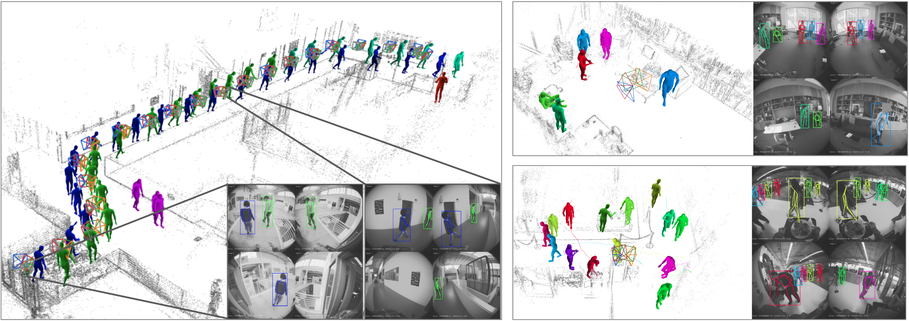
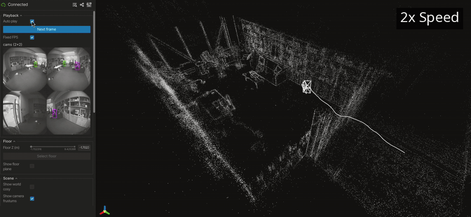
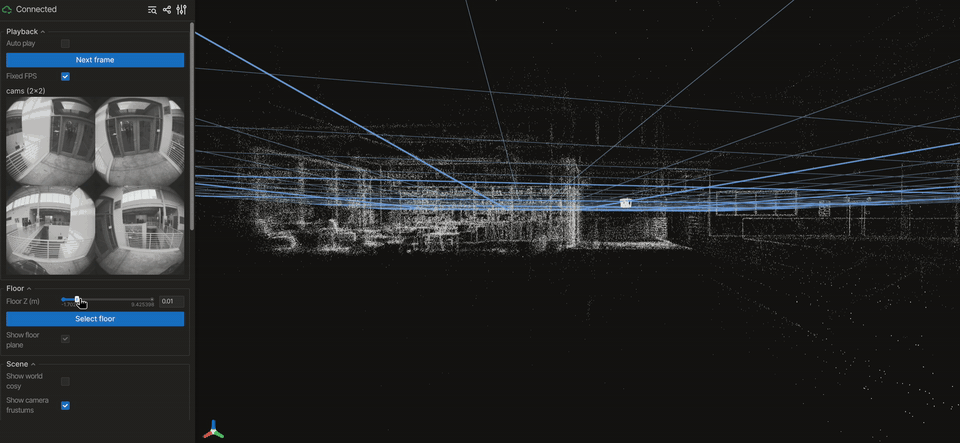

<div align="center">

# 💡LAMP: Localization Aware Multi-camera People Tracking in Metric 3D World

[](https://facebookresearch.github.io/LAMP)
[](https://arxiv.org/abs/2605.05390)
[](https://youtu.be/pJv1xJ-ssUQ)

**CVPR 2026**

[Nan Yang](https://nan-yang.me/) · [Julian Straub](https://jstraub.github.io/) · [Fan Zhang]() · [Richard Newcombe](https://rapiderobot.bitbucket.io/) · [Jakob Engel](https://jakobengel.github.io/) · [Lingni Ma](https://scholar.google.com/citations?user=eUAgpwkAAAAJ&hl=en)

*Meta Reality Labs Research*

</div>



LAMP tracks 3D human motion from egocentric multi-camera headsets via early disentanglement of observer and target motion. Using known device 6-DoF motion and calibration, 2D body keypoints from all cameras over a temporal window are lifted into a unified 3D world reference frame, and an end-to-end trained spatio-temporal transformer fits 3D human motion directly to this 3D ray cloud. This "lift-then-fit" approach achieves state-of-the-art results on monocular benchmarks while significantly outperforming baselines on the targeted egocentric setting.


## Installation

LAMP needs an NVIDIA GPU with a driver that supports CUDA 12. The CUDA runtime, cuDNN, and TensorRT are installed into the virtual environment via pip, so no system-wide CUDA toolkit is required — only the driver comes from the host. We tested on Fedora with a CUDA 12 driver.


```bash
# Install uv (https://docs.astral.sh/uv/) if not already installed.
curl -LsSf https://astral.sh/uv/install.sh | sh

# Create virtual environment with uv
uv venv .venv --python 3.12
source .venv/bin/activate

# Install dependencies
uv pip install -r requirements.txt
uv pip install wheel_stub
uv pip install --no-build-isolation 'tensorrt-cu12==10.16.1.11'
# Headless OpenCV avoids GL/display errors on server.
uv pip uninstall opencv-python || true
uv pip install --force-reinstall opencv-python-headless==4.13.0.92

# Smoke test
python scripts/smoke_test.py
```

The same setup can be run with the convenience script:

```bash
bash scripts/install.sh
source .venv/bin/activate
```

## Model and Test Data
Required runtime artifacts:

- LAMP SMPL checkpoint as a plain `.pt` state dict from `facebook/LAMP`.
- SMPL neutral `.pkl` from the official SMPL download source.
- A flat recording folder from the `facebook/LAMP` dataset containing `video.vrs`, `closed_loop_trajectory.csv`, `online_calibration.jsonl`, and `semidense_points.csv.gz`.
- Optional RF-DETR weights; when omitted, RF-DETR downloads its default checkpoint to `~/.cache/lamp`.

We host the model [checkpoint](https://huggingface.co/facebook/LAMP) and the sample [data](https://huggingface.co/datasets/facebook/LAMP) recorded with [Project Aria Gen2](https://www.projectaria.com/) on HuggingFace. You can download them via the following script:

```bash
bash scripts/fetch_artifacts.sh
```


### Preparing the SMPL model

The above script will NOT download the SMPL model. Please download `basicmodel_neutral_lbs_10_207_0_v1.0.0.pkl` from [here](https://smplify.is.tue.mpg.de/) (Login -> Downloads -> SMPLIFY_CODE_V2.ZIP).

The official SMPL `.pkl` stores its arrays as [Chumpy](https://github.com/mattloper/chumpy) objects that no longer load under modern NumPy/Python. Chumpy cannot be installed in the LAMP environment, so strip it out once in a throwaway environment and keep only the resulting plain-NumPy `.pkl`:

```bash
# One-time conversion, isolated from the LAMP venv.
uv python install 3.10
uv venv /tmp/smpl_clean --python 3.10 && source /tmp/smpl_clean/bin/activate
uv pip install pip setuptools wheel "numpy<1.24"
uv pip install chumpy==0.70 --no-build-isolation   # chumpy's setup.py imports pip
# Load with chumpy, convert the chumpy arrays to plain NumPy, write to data/.
# Run this from the repo root.
python - <<'EOF'
import pickle
import numpy as np

src = "/path/to/basicmodel_neutral_lbs_10_207_0_v1.0.0.pkl"
with open(src, "rb") as f:                  # latin1 decodes the Python-2 pickle
    data = pickle.load(f, encoding="latin1")
clean = {k: (np.array(v) if "chumpy" in str(type(v)).lower() else v)
         for k, v in data.items()}
with open("data/SMPL_NEUTRAL.pkl", "wb") as f:
    pickle.dump(clean, f)
print("wrote data/SMPL_NEUTRAL.pkl")
EOF
deactivate
```

That writes the chumpy-free model straight to `data/SMPL_NEUTRAL.pkl`, ready for LAMP.

## Demo Run

From the repo root, with the venv activated:

```bash
python -m lamp.app.cli run \
  --recording ./data/test-library \
  --checkpoint ./ckpts/lamp_smpl_aria_gen2.pt \
  --smpl-model-path ./data/SMPL_NEUTRAL.pkl
```



Optionally, we can set the ground-plane height before starting to get better global pose estimation accuracy: in the viewer's **Floor** folder, drag `Floor Z (m)` to the floor and click `Select floor`.



## Acknowledgements
- [RF-DETR](https://github.com/roboflow/rf-detr) for person detection and
- [ViTPose](https://github.com/ViTAE-Transformer/ViTPose) for 2D keypoint
estimation.
- [MotionBERT](https://github.com/Walter0807/MotionBERT) for the inspiration of the spatial-temporal transformer.
- [SMPL](https://smpl.is.tue.mpg.de/) and [smplx](https://github.com/vchoutas/smplx) package for the human body model.
- [Boxer](https://github.com/facebookresearch/boxer) for the camera projection functions.
- [Viser](https://github.com/nerfstudio-project/viser) for the interactive 3D web visualizer.

## Citation

```bibtex
@inproceedings{yang2026lamp,
  title     = {{LAMP}: Localization Aware Multi-camera People Tracking in Metric {3D} World},
  author    = {Yang, Nan and Straub, Julian and Zhang, Fan and Newcombe, Richard and Engel, Jakob and Ma, Lingni},
  booktitle = {Proceedings of the IEEE/CVF Conference on Computer Vision and Pattern Recognition (CVPR)},
  year      = {2026}
}
```

## License

LAMP is CC-BY-NC licensed, as found in the [LICENSE](LICENSE) file.
